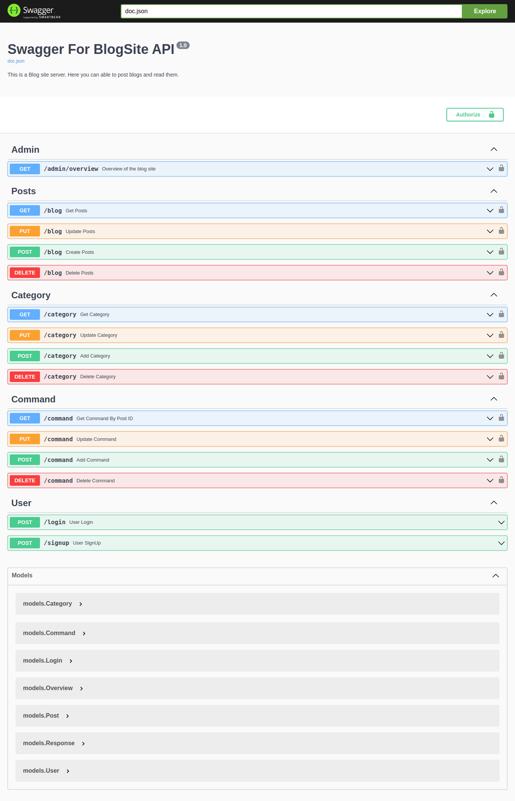

# Blog Site

In this blog site server the admin can able to post the blogs and users can able to read those blogs and share their thoughts about the blog in the command section.

## Softwares Used

- GO (1.22.6 version)
- Fiber framework
- GORM
- Logrus
- Swaggo
- Validator
- Redis
- Postgres
- Docker

## Installation

### Step 1
#### Clone the Repo
```bash
    git clone https://github.com/blockchaindev100/Go-Blog-Site.git
```

### Step 2
#### Start the docker container

```bash
    docker-compose up
```
### Step 3
#### Open the swagger and try to hit the endpoints

```bash
    http://localhost:8080/swagger/index.html
```
<br>
<br>

